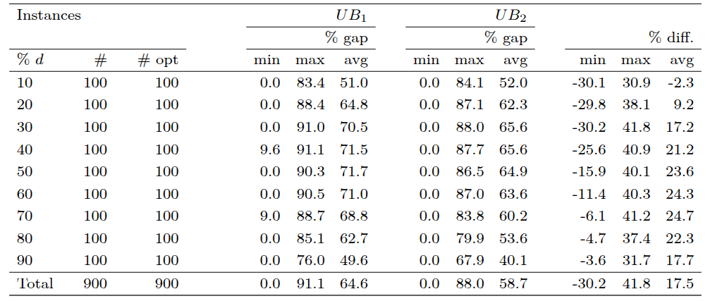

# Some additional results tables

This file contains comparative tables between $UB_1$ and $UB_2$ on randomly generated instances.

## Table Structure

### Columns
- **|V|**: Number of vertices in the graph
- **% d**: Percentage graph density
- **#**: number of instances sharing the same parameters
- **# opt**: number of instances solved to fully optimality
- **% gap**: Gap of the bound with the actual edge-weighted clique number of the graph
- **% diff.**: Percentage difference between the two bounds, computed as:

 $$\% \text{diff.} = 100 \, \frac{UB_1 - UB_2}{\max\{UB_1, \, UB_2\}}$$

## Table Descriptions

### `table_random_densities_n100.png`
Comparison between $UB_1$ and $UB_2$ on random graphs with **fixed n=100 nodes** and **variable density** (also including the high densities in the range [0.91, 0.99]).

### `table_random_densities.png`
Comparison between $UB_1$ and $UB_2$ on random graphs with **variable density**, exluding high densities.

## Tables

*Table 1: Comparison of upper bounds on random graphs with 100 nodes and varying density*

*Table 2: Comparison of upper bounds on random graphs with varying density and number of nodes*

