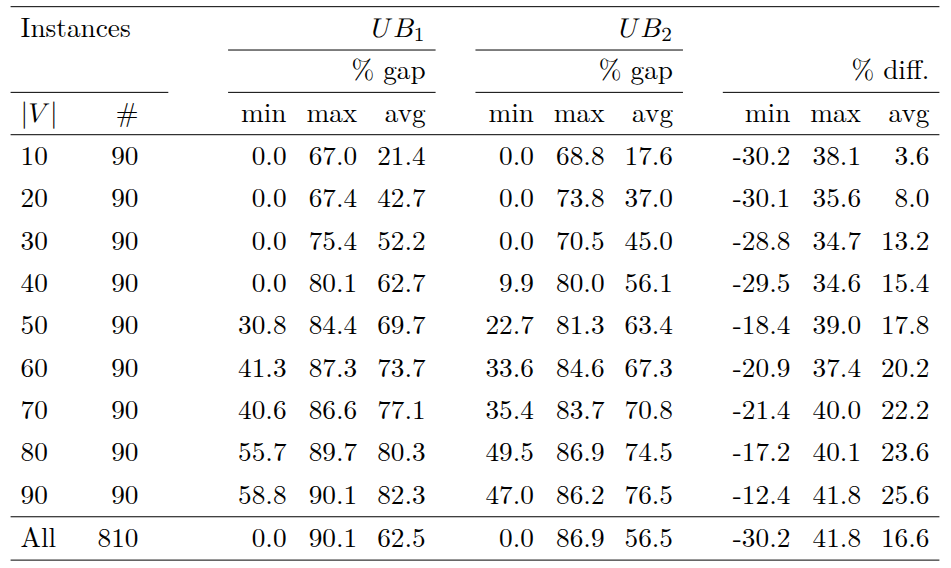
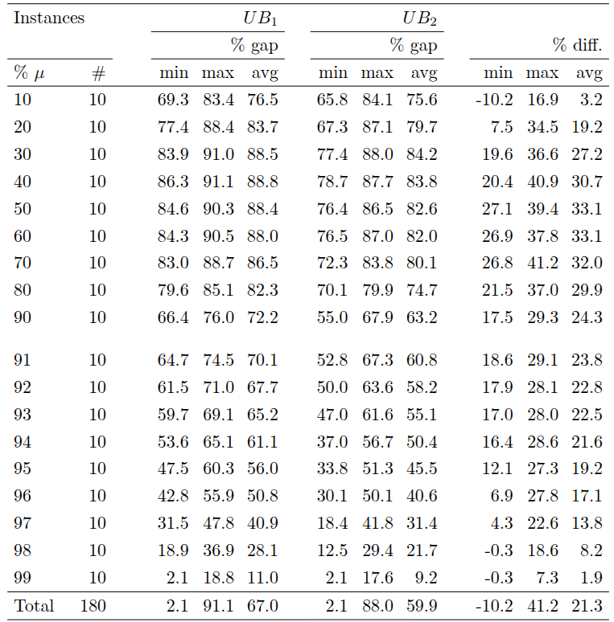
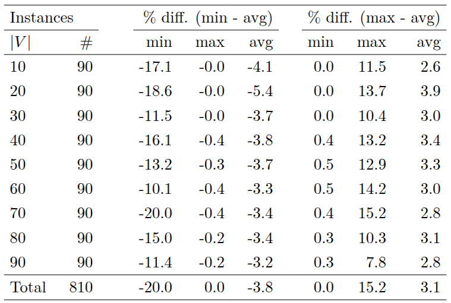
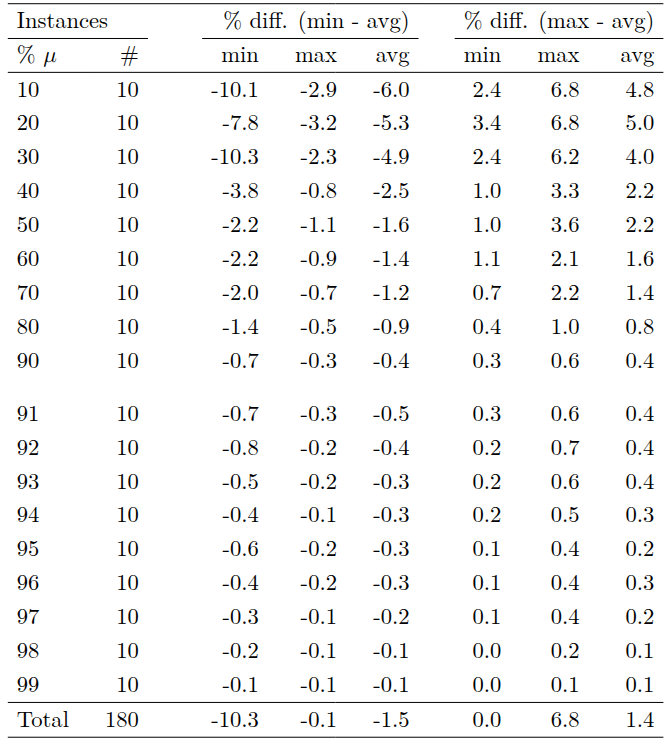
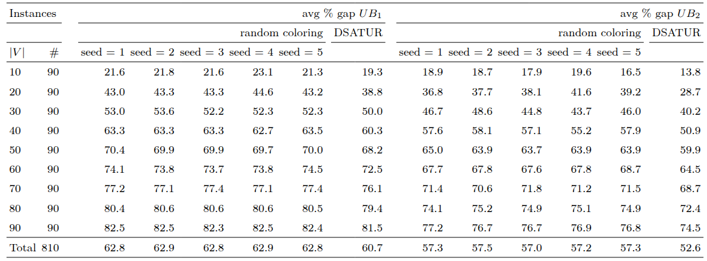
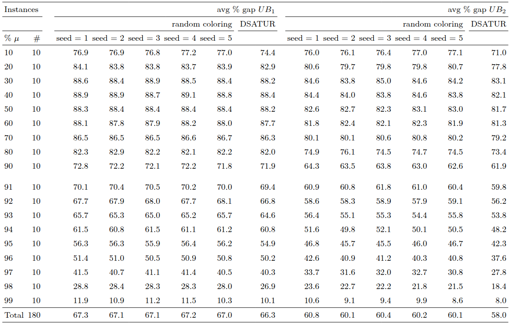
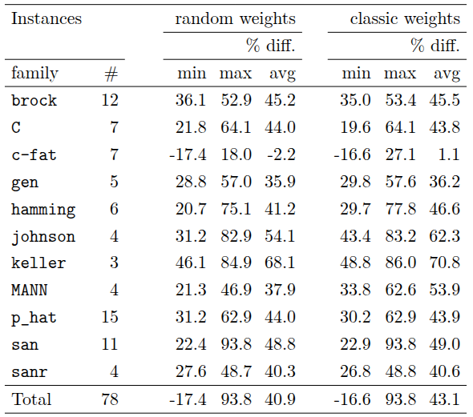

# Some additional computational results

This file contains additional numerical results that supplement those presented in the paper.

## Table Structure

### Columns

The following column headers are shared across multiple tables presented below and are therefore defined here for reference:

- **|V|**: Number of vertices in the graph
- **% $\mu$**: Percentage edge density of the graph
- **#**: number of instances sharing the same parameters
- **# opt**: number of instances solved to fully optimality
- **% gap**: percentage gap of the bound with the actual edge-weighted clique number of the graph
- **% diff.**: percentage difference between the two bounds, computed as:

 $$\% \text{diff.} = 100 \, \frac{UB_1 - UB_2}{\max\{UB_1, \, UB_2\}}$$

## Tables

*Table 1: Comparison of $UB_1$ and $UB_2$ on random graphs with varying number of vertices*

 
 

*Table 2: Comparison of $UB_1$ and $UB_2$ on random graphs with $|V| = 100$ and varying density*

 
 
 
 

Tables 3 and 4, which follow, present numerical results aimed at studying the variation of the value of $UB_2$ across different orderings of independents of the same coloring (specifically, obtained through DSATUR). The reported statistics analyze how the minimum and maximum bound values deviate from the average across these different orderings.

*Table 3: $UB_2$ variation across 10 different independent set orderings in graph coloring*

 
 

*Table 4: $UB_2$ variation across 10 different independent set orderings in graph coloring ($|V| = 100$)*

 
 
 
 

Tables 5 and 6 demonstrate how the average gap between the upper bound values and the optimal edge-weight clique number of the instances is sensitive to the chosen coloring method.

*Table 5: Average percentage gap of $UB_1$ and $UB_2$ across different colorings*

 
 

*Table 5: Average percentage gap of $UB_1$ and $UB_2$ across different colorings ($|V| = 100$)*

 
 
 
 

The following table shows the percentage difference between the two upper bounds across DIMACS families, but with random weights of the graph edges. Since we do not have an optimal solution value for the EWMCP on instances with random edge weights, gap-related statistics are omitted.

*Table 6: Percentage difference between $UB_1$ and $UB_2$ for DIMACS instances with random edge weights*

